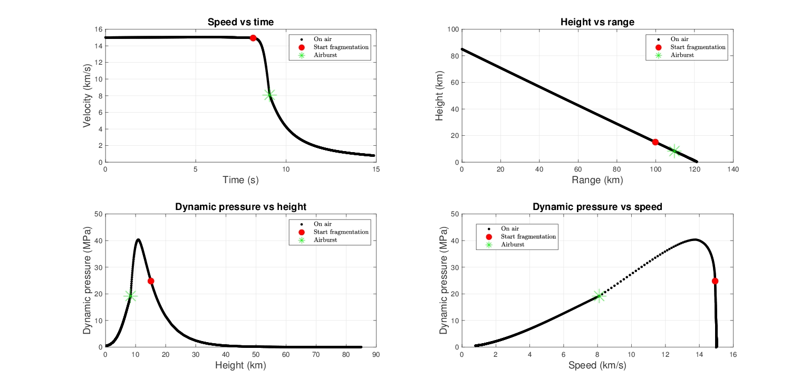

# Tunguska Fall Model
Matlab software for describing the fall of the TCB (Tunguska Cosmic Body) using the pancake model until the airburst. After the airburst, it describes the trajectory to the ground of a fragment that survives the airburst phase. 
The starting point is in the "Settings.txt" file; default values, as the path, can be changed. You'll need to install Matlab on your PC (version 2019 or higher). To use it, read the paper Carbognani et al., Computation of a possible Tunguska's strewn field, https://arxiv.org/abs/2302.13620. 

The results with the default values in "Settings.txt" are represented in the figure that shows the output of the TFM with initial kinetic energy 15 Mt, height 85 km, speed 15 km/s, $\Gamma = 0.58$, mean density $3290 ~\textrm{kg}/\textrm{m}^3$, diameter 69 m, inclination $35^\circ$, pancake factor 7.5 and TCB's mean strength 25 MPa. Duration of the pancake phase, from the fragmentation to the airburst, 0.9 s. Airburst at 8.3 km and maximum dynamic pressure 40.4 MPa. A fragment of 1.4 m diameter with a strength of 100 MPa touches the ground with a diameter of about 1.2 m at a speed of about 0.7 km/s.

